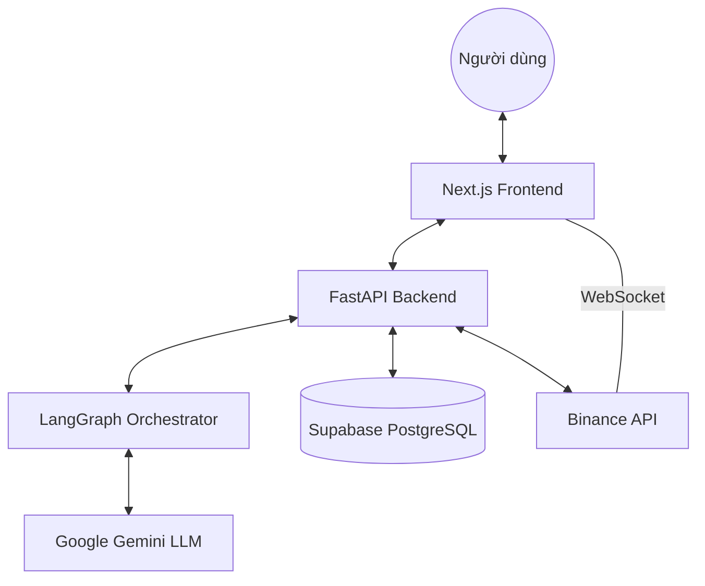

# Chương 3: Mô tả hệ thống & Luồng xử lý (System Architecture & Flow)

Chương này trình bày chi tiết về kiến trúc kỹ thuật của PLAND, giải cấu trúc các thành phần từ Backend, Database đến quy trình điều phối AI Multi-Agent theo tiêu chuẩn hệ thống tài chính chuyên nghiệp.

## 3.1 Kiến trúc Tổng quan (High-Level Architecture)

PLAND được xây dựng theo kiến trúc **Decoupled Architecture (Kiến trúc tách rời)** để đảm bảo tính mở rộng và hiệu suất cao.

- **Frontend (Next.js)**: Đảm nhận giao diện người dùng, quản lý trạng thái local và kết nối WebSocket trực tiếp với sàn để tối ưu tốc độ cập nhật giá.
- **Backend (FastAPI)**: Đóng vai trò là "bộ não" điều phối, quản lý API, xác thực dữ liệu và chuẩn bị Context cho AI.
- **AI Orchestrator (LangGraph)**: Lớp trung gian quản lý quy trình suy luận phức tạp của nhiều Agent.
- **Data Persistence (Supabase)**: Lưu trữ hồ sơ người dùng, lịch sử phân tích và các snapshot danh mục.

## 3.2 Tầng Backend & API Specification

Hệ thống sử dụng **FastAPI (Python)** để tận dụng cơ chế **Asyncio**, cho phép xử lý hàng trăm yêu cầu đồng thời mà không nghẽn mạch (Non-blocking I/O).

### 3.2.1 Các Endpoint Cốt lõi

- **`POST /api/evaluate`**: Endpoint trung tâm khởi chạy quy trình phân tích danh mục.
- **`POST /api/binance/connection/preview`**: Xử lý kết nối và kiểm tra quyền truy cập (Read-only) của API Key.
- **`GET /api/trading_agent/trace`**: Trích xuất dữ liệu suy luận chi tiết của AI để phục vụ tính minh bạch (XAI).

### 3.2.2 Quy trình xác thực và Kiểm soát dữ liệu

Hệ thống sử dụng **Pydantic Models** để ép kiểu dữ liệu đầu vào và đầu ra nghiêm ngặt. Mọi yêu cầu đều được kiểm tra tính hợp lệ (Validation) trước khi chuyển vào tầng xử lý AI, giúp giảm thiểu rủi ro lỗi Runtime.

## 3.3 Tầng Trí tuệ Nhân tạo Multi-Agent (AI Orchestration)

PLAND triển khai mô hình **Multi-Agent Debate (MAD)** thông qua **LangGraph**, cho phép các AI Agent không chỉ làm việc độc lập mà còn có khả năng phản biện và tranh luận để tối ưu hóa quyết định.

### 3.3.1 Cấu trúc Đồ thị Luồng (Graph Topology)

Kiến trúc AI của PLAND được vận hành dựa trên một đồ thị trạng thái tuần tự và có tính lặp (Stateful Graph), khởi đầu bằng lớp Xác thực và Chuẩn bị Context. Tại đây, hệ thống sẽ đồng bộ dữ liệu thị trường thực tế để tạo ra một Snapshot đồng nhất cho tất cả các tác nhân. Quy trình sau đó tiến vào **Giai đoạn Phân tích Tuần tự**, nơi các Agent chuyên biệt về kỹ thuật (Technical Analyst), tin tức (News Analyst), tâm lý (Sentiment Analyst) và cấu trúc danh mục (Portfolio Structure Analyst) lần lượt xử lý dữ liệu để xây dựng một nền tảng thông tin đa chiều.

Điểm khác biệt cốt lõi nằm ở **Giai đoạn Tranh luận Chiến lược**. Thay vì đưa ra quyết định ngay lập tức, dữ liệu phân tích được chuyển cho đội ngũ Researcher với hai quan điểm đối lập: Bull Researcher (theo trường phái lạc quan) và Bear Researcher (theo trường phái bi quan). Hai Agent này sẽ thực hiện các vòng phản biện để làm rõ cơ hội và rủi ro, trước khi Investment Manager tổng hợp thành một chiến lược đầu tư thống nhất. Chiến lược này sau đó được cụ thể hóa thành các kế hoạch giao dịch bởi Trader Agent.

Cuối cùng, hệ thống bước vào **Giai đoạn Tranh luận Rủi ro**, một quy trình thẩm định gắt gao với sự tham dự của 3 chuyên gia rủi ro mang các thiên hướng khác nhau: Aggressive, Conservative và Neutral. Các chuyên gia này sẽ mổ xẻ kế hoạch của Trader Agent dưới các kịch bản thị trường khắc nghiệt nhất. Risk Judge sẽ dựa trên kết quả tranh luận này để đưa ra phán quyết cuối cùng, đảm bảo mọi hành động đều phải vượt qua lớp Rào chắn an toàn (Guardrails) trước khi kết thúc quy trình xử lý.

### 3.3.2 Chi tiết các Vòng lặp Tranh luận

- **Investment Debate Loop**: `BullResearcher` và `BearResearcher` sẽ tranh luận qua lại trong 2 vòng (configurable). Mỗi Agent sử dụng **Conversation Memory** để tham chiếu ý kiến của đối phương và đưa ra các luận điểm phản bác, giúp `Investment Manager` có cái nhìn đa chiều nhất.
- **Risk Debate Loop**: Ba chuyên gia rủi ro (`Aggressive`, `Conservative`, `Neutral`) sẽ đánh giá kế hoạch giao dịch từ `Trader Agent`. Sự kết hợp giữa các góc nhìn cực đoan và trung lập giúp `Risk Judge` đưa ra phán quyết an toàn nhất cho danh mục.

### 3.3.3 Quản lý Trạng thái & Dấu vết (State & Traceability)

Mỗi Agent khi thực hiện xong sẽ đẩy kết quả vào `TradingAgentState` và tạo ra một `WorkflowTraceEvent`. Điều này cho phép PLAND trích xuất toàn bộ "Biên bản cuộc họp AI" (AI Meeting Minutes), giúp người dùng thấy được quá trình từ lúc nảy sinh ý tưởng đến khi tranh luận và chốt phương án cuối cùng.

## 3.4 Tầng Dữ liệu & Snapshot mechanism

Để giải quyết bài toán giá tiền điện tử biến động từng giây (Price Drift), PLAND triển khai cơ chế **Snapshotting**:

- **Bất biến (Immutability)**: Khi người dùng bấm "Analyze", hệ thống sẽ chụp lại một tấm ảnh (Snapshot) toàn bộ giá và các chỉ số tại thời điểm đó.
- **Trải nghiệm XAI**: Kết quả AI hiển thị sẽ dựa trên Snapshot này, giúp người dùng hiểu chính xác tại sao AI ra quyết định đó, ngay cả khi giá thị trường đã thay đổi sau đó 5 phút.

## 3.5 Cơ chế Thời gian thực & Quan sát (Real-time & Observability)

- **WebSocket Stream**: Tận dụng hạ tầng của Binance để đẩy giá Market theo thời gian thực trực tiếp tới Client.
- **Audit Trail**: Mỗi quyết định của AI được lưu vào cơ sở dữ liệu với đầy đủ các Input/Output của từng Agent thành phần, phục vụ việc hậu kiểm và cải thiện thuật toán.

---

_Kiến thức trúc này đảm bảo PLAND không chỉ là một chatbot AI, mà là một hệ thống tài chính chuyên sâu, an toàn và có khả năng giải trình cao._
