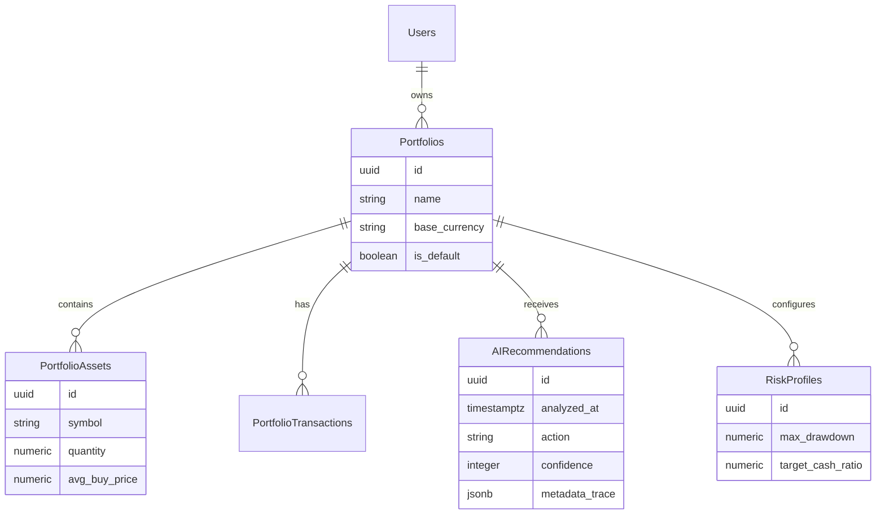

# Chương 4: Chi tiết kiến trúc Multi-Agent & Database (Architecture & Database)

PLAND được thiết kế để xử lý các phân tích phức tạp một cách đồng thời, đảm bảo tính nhất quán và khả năng mở rộng.

## 4.1 Kiến trúc điều phối (LangGraph Orchestrator)
Chúng tôi sử dụng **LangGraph** để xây dựng luồng làm việc của AI. Khác với các hệ thống AI đơn lẻ (Monolithic), LangGraph cho phép ta định nghĩa một đồ thị trạng thái (State Graph) nơi các Agent có thể chuyên môn hóa.

*   **Nodes:** Mỗi Agent (TA, Sentiment, Risk, Synthesis) là một Node trong đồ thị.
*   **Parallel Execution (Fan-out):** Khi bắt đầu phân tích, 3 Agent (TA, Sentiment, Risk) được kích hoạt đồng thời (`asyncio.gather`), giúp tối ưu hóa thời gian phản hồi.
*   **State Management:** Một đối tượng `AgentState` được truyền qua các Node để lưu trữ dữ liệu đầu vào và kết quả trung gian.

## 4.2 Chi tiết các Specialist Agents
1.  **TA Agent:** Xử lý các chỉ số kỹ thuật thô thành các quan sát (`key_observations`) và đưa ra tín hiệu sơ bộ.
2.  **Sentiment Agent:** Phân tích tin tức và tâm lý thị trường, gán điểm `sentiment_score` và xác định `bias`.
3.  **Risk Agent:** "Người gác cổng" cuối cùng. Kiểm tra các quy tắc rủi ro và giới hạn vị thế. Nếu rủi ro ở mức **High/Critical**, Agent này có quyền phủ quyết (Veto) các hành động mua mới.
4.  **Synthesis Agent:** Tổng hợp toàn bộ dữ liệu từ 3 Agent trên để đưa ra đề xuất cuối cùng (`final_recommendation`) và lý do (`reasoning`).

## 4.3 Sơ đồ thực thể liên kết (ERD)
Dữ liệu được lưu trữ trên **Supabase (PostgreSQL)** với tính toàn vẹn dữ liệu cao.

## 4.4 Chiến lược lưu trữ dữ liệu (Data Persistence)
Hệ thống tuân thủ nguyên tắc **"No loss of reasoning"**:
*   Mỗi khi AI thực hiện một phiên phân tích, toàn bộ "Trace" (dấu vết suy luận) từ các agent thành phần được lưu vào trường `metadata` của bảng `portfolio_ai_recommendations`.
*   Điều này cho phép người dùng xem lại lịch sử tại sao AI lại đưa ra lời khuyên đó tại một thời điểm cụ thể trong quá khứ.

## 4.5 Tech Stack Overview
| Thành phần | Công nghệ | Vai trò |
| :--- | :--- | :--- |
| **Frontend** | Next.js 15 (App Router) | UI, Dashboard, WebSocket client |
| **Backend** | FastAPI (Python 3.11+) | Multi-agent execution, API Gateway |
| **AI Library** | LangGraph + LangChain | Orchestration, State management |
| **Database** | Supabase (Postgres) | Auth, Storage, Row Level Security |
| **LLM Provider** | Google Gemini | Core Reasoning Engine |

---
*Kiến trúc này đảm bảo PLAND có thể dễ dàng mở rộng để hỗ trợ hàng trăm nghìn người dùng với độ trễ cực thấp.*
