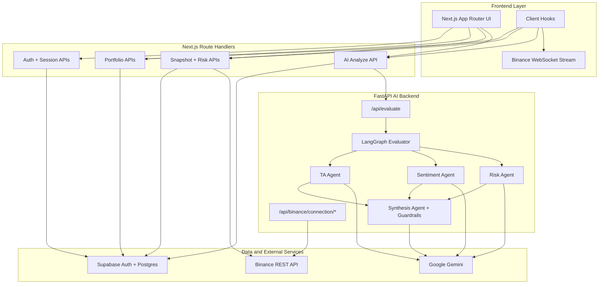
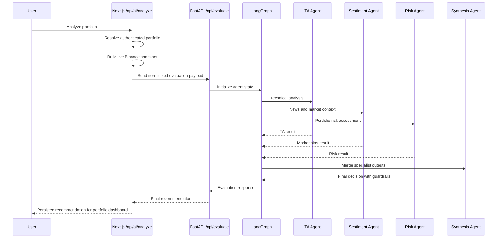

<div align="center">
  <h1>PLAND</h1>
  <p><strong>AI-Powered Crypto Portfolio Intelligence Platform</strong></p>
  <p>Track portfolios, monitor risk, sync Binance data, and generate multi-agent AI recommendations with Next.js, Supabase, FastAPI, and LangGraph.</p>

  <p>
    <a href="https://nextjs.org"></a>
    <a href="https://www.typescriptlang.org"></a>
    <a href="https://supabase.com"></a>
    <a href="https://fastapi.tiangolo.com"></a>
    <a href="https://www.langchain.com/langgraph"></a>
    <a href="LICENSE"></a>
  </p>
</div>

## Table of Contents

- [Overview](#overview)
- [Key Features](#key-features)
- [Architecture](#architecture)
- [Tech Stack](#tech-stack)
- [Quick Start](#quick-start)

## Overview

PLAND is a full-stack crypto portfolio analysis application built around two complementary layers:

- A `Next.js` application for authentication, portfolio management, risk monitoring, journal analytics, and UI-driven AI workflows.
- A `FastAPI` service that runs a `LangGraph`-based multi-agent evaluator for technical analysis, market sentiment, risk assessment, and final recommendation synthesis.

The current codebase supports:

- User authentication with `Supabase Auth`
- Manual portfolios and `Binance`-connected portfolios
- Live portfolio snapshots with exchange data and cache fallback
- Portfolio-level risk rules and recent risk event monitoring
- Trading journal summaries with PnL and BTC-normalized performance
- AI recommendations generated from TA, sentiment, risk, and post-synthesis guardrails

## Key Features

| Feature | Description | Codebase Reality |
| --- | --- | --- |
| Live portfolio snapshot | The portfolio page loads cached or live Binance-backed data and refreshes continuously. | `app/api/binance/portfolio` plus `usePortfolioSnapshot()` |
| Real-time market updates | The frontend subscribes to Binance ticker streams and applies price updates client-side. | `usePortfolioSnapshot()` opens Binance WebSocket streams |
| Multi-portfolio management | Users can create, list, and remove portfolios with support for manual and connected modes. | `app/api/portfolios` and Supabase repositories |
| Binance connection preview | The app can preview balances and normalize connected positions before syncing. | `app/api/binance/connection/preview` and FastAPI connector routes |
| AI recommendation workflow | Portfolio analysis runs through TA, sentiment, risk, and synthesis stages. | `backend/agents/graph.py` |
| Guardrail-aware decisions | High-risk and critical-risk scenarios can override aggressive AI actions. | `backend/core/guardrails.py` |
| Risk monitoring | Risk profiles, effective limits, and recent violations are surfaced per portfolio. | `app/api/risk/events` |
| Trading journal analytics | Journal pages summarize realized sell events, win rate, PnL, and BTC-denominated results. | `app/api/journal/summary` |

## Architecture

### System Overview



### AI Evaluation Workflow



### Request Boundaries

- `Next.js` owns authentication, user-specific data access, Supabase integration, and product-facing APIs.
- `FastAPI` owns portfolio evaluation orchestration and Binance connection helper endpoints used by the UI.
- `Binance` provides both REST market data and browser-side real-time ticker streams.

## Tech Stack

| Layer | Technology | Purpose |
| --- | --- | --- |
| Frontend | `Next.js` + `React` + `TypeScript` | App Router UI, route handlers, and client-side dashboards |
| Styling | `Tailwind CSS v4` | Utility-first styling for the web app |
| Auth and database | `Supabase` | Auth, Postgres storage, and row-level access patterns |
| AI backend | `FastAPI` + `Uvicorn` | Async Python API for analysis and exchange connector workflows |
| Multi-agent orchestration | `LangGraph` + `LangChain` | Specialist-agent fan-out/fan-in evaluation graph |
| Model provider | `Google Gemini` via `langchain-google-genai` | Structured-output LLM calls in backend agents |
| Market data | `Binance REST API` + `Binance WebSocket` | Snapshot generation and real-time ticker updates |
| Testing | `pytest` + `FastAPI TestClient` | API, orchestration, and guardrail test coverage |
| Deployment | `Vercel` config included | Frontend hosting and web configuration |

## Quick Start

### Prerequisites

- `Node.js 20+`
- `npm 10+`
- `Python 3.11+`
- A `Supabase` project or local Supabase CLI environment
- A `GEMINI_API_KEY`

### 1. Install dependencies

```bash
npm install
python -m venv .venv
```

Activate the virtual environment and install backend packages:

```bash
# Windows
.\.venv\Scripts\activate

# macOS / Linux
source .venv/bin/activate

pip install -r requirements.txt
```

### 2. Configure environment variables

Copy `.env.example` to `.env`, then fill in the required values.

```bash
cp .env.example .env
```

### 3. Prepare Supabase

This repository includes:

- Supabase config: `supabase/config.toml`
- SQL migrations: `supabase/migrations`

Local Supabase workflow:

```bash
supabase start
supabase db reset
```

### 4. Run the application

Start the FastAPI backend from the repository root:

```bash
uvicorn backend.main:app --reload
```

Start the Next.js app in a second terminal:

```bash
npm run dev
```

### 5. Verify services

| Service | URL |
| --- | --- |
| Frontend | `http://localhost:3000` |
| FastAPI backend | `http://localhost:8000` |
| FastAPI health check | `http://localhost:8000/health` |
| FastAPI docs | `http://localhost:8000/docs` |

Basic verification:

```bash
curl http://localhost:8000/health
```
